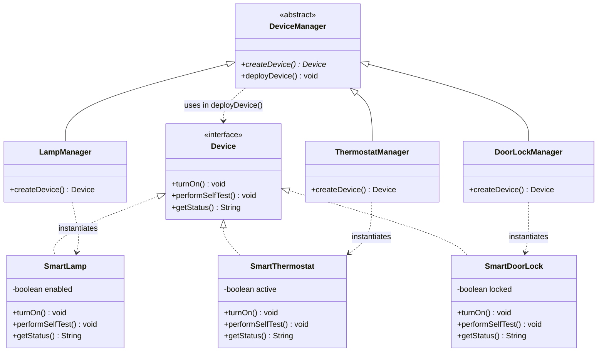
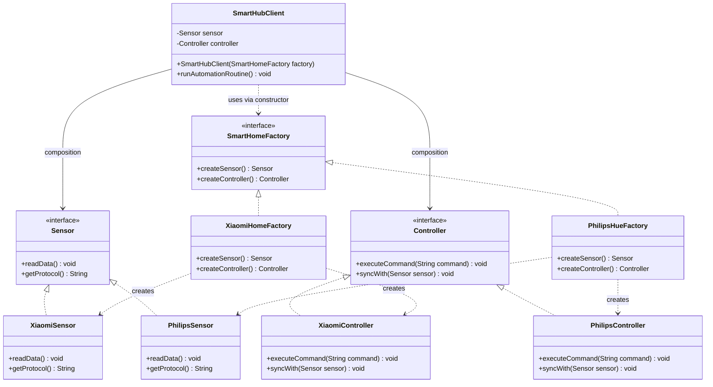

# Assignment 2: Creational Patterns — Factory Method & Abstract Factory

## Overview
* **Theme:** Smart-Home Hub[cite: 3]
* **Course:** Software Design Patterns
* **Objective:** Eliminate hard-coded `new ConcreteClass()` calls and growing conditional logic by applying the **Factory Method** pattern (Part A: single product) and the **Abstract Factory** pattern (Part B: product family)[cite: 2, 3].

---

## Project Structure

```text
assignment2-design-patterns/
├── src/
│   ├── factorymethod/
│   │   ├── Device.java
│   │   ├── SmartLamp.java
│   │   ├── SmartThermostat.java
│   │   ├── SmartDoorLock.java
│   │   ├── DeviceManager.java
│   │   ├── LampManager.java
│   │   ├── ThermostatManager.java
│   │   ├── DoorLockManager.java
│   │   └── MainFactoryMethod.java
│   └── abstractfactory/
│       ├── Sensor.java
│       ├── Controller.java
│       ├── XiaomiSensor.java
│       ├── XiaomiController.java
│       ├── PhilipsSensor.java
│       ├── PhilipsController.java
│       ├── SmartHomeFactory.java
│       ├── XiaomiHomeFactory.java
│       ├── PhilipsHueFactory.java
│       ├── SmartHubClient.java
│       └── MainAbstractFactory.java
└── README.md
```

---

## Part A: Factory Method (Single Product)

### Description
Part A abstracts device provisioning logic from concrete class instantiations[cite: 2, 3]. High-level routines interact only with the `Device` interface, while concrete creator subclasses decide which device to instantiate[cite: 2, 3].

* **Product:** `Device` (`turnOn()`, `performSelfTest()`, `getStatus()`)[cite: 3]
* **Concrete Products:** `SmartLamp`, `SmartThermostat`, `SmartDoorLock`[cite: 3]
* **Creator:** Abstract class `DeviceManager` with the factory method `createDevice()` and business method `deployDevice()`[cite: 2, 3]
* **Concrete Creators:** `LampManager`, `ThermostatManager`, `DoorLockManager`[cite: 3]

### UML Diagram



---

## Part B: Abstract Factory (Product Family)

### Description
Part B guarantees complete protocol and architectural alignment between peripheral equipment within a vendor ecosystem[cite: 2, 3]. Incompatible cross-vendor combinations (e.g., pairing a proprietary Xiaomi sensor with a Philips Hue controller) are prevented at compile time[cite: 2, 3].

* **Abstract Products:** `Sensor` and `Controller`[cite: 2, 3]
* **Xiaomi Family:** `XiaomiSensor`, `XiaomiController` (Zigbee protocol)[cite: 2, 3]
* **Philips Hue Family:** `PhilipsSensor`, `PhilipsController` (Matter/Thread protocol)[cite: 2, 3]
* **Abstract Factory:** `SmartHomeFactory` (`createSensor()`, `createController()`)[cite: 2, 3]
* **Concrete Factories:** `XiaomiHomeFactory`, `PhilipsHueFactory`[cite: 2, 3]
* **Client:** `SmartHubClient` receives `SmartHomeFactory` via composition (constructor) and interacts solely with abstractions[cite: 2, 3]

### UML Diagram



---

## Pattern Comparison

| Feature | Factory Method (Part A) | Abstract Factory (Part B) |
| :--- | :--- | :--- |
| **Product Cardinality** | Instantiates **one** product (`Device`)[cite: 2, 3] | Instantiates a **family** of products (`Sensor` + `Controller`)[cite: 2, 3] |
| **OOP Mechanism** | Relies on **inheritance** (subclasses override factory method)[cite: 2, 3] | Relies on **composition** (client delegates to injected factory)[cite: 2, 3] |
| **Abstraction Level** | Lower — focuses on a single product[cite: 2] | Higher — manages related product suites[cite: 2] |
| **Extension Vector** | Adding a new product requires adding a new Creator subclass[cite: 2] | Adding a new family requires adding a new Concrete Factory[cite: 2] |
| **Weak Spot** | Proliferation of creator subclasses[cite: 2] | Adding a new product type breaks the factory interface and all implementations[cite: 2, 3] |

---

## SOLID Principles & Clean Code

* **Single Responsibility Principle (SRP):** Object construction is isolated within creators and factories, keeping high-level domain workflows clean[cite: 2, 3].
* **Open/Closed Principle (OCP):** New devices and vendor ecosystems can be added without modifying existing client business logic[cite: 2, 3].
* **Dependency Inversion Principle (DIP):** High-level orchestrators (`DeviceManager`, `SmartHubClient`) depend entirely on abstractions rather than concrete types[cite: 2, 3].
* **Clean Code & Law of Demeter:** Train-wreck method chaining is eliminated[cite: 2]. Clients only communicate with immediate dependencies, methods maintain single responsibilities, and flag arguments are avoided[cite: 1, 2].

---

## How to Build and Run

### Compilation
```bash
javac -d bin src/factorymethod/*.java src/abstractfactory/*.java
```

### Execution
Run Part A:
```bash
java -cp bin factorymethod.MainFactoryMethod
```

Run Part B:
```bash
java -cp bin abstractfactory.MainAbstractFactory
```

---

## Defense Q&A Preparation

* **Where does the client stop depending on concrete classes?**
  In Part A, inside `DeviceManager` and `MainFactoryMethod` via `Device`[cite: 2, 3]. In Part B, inside `SmartHubClient` via `SmartHomeFactory`, `Sensor`, and `Controller`[cite: 2, 3].
* **Why Factory Method vs Abstract Factory?**
  Factory Method creates one product via inheritance; Abstract Factory creates families of compatible products via composition[cite: 2, 3].
* **Inheritance vs Composition:**
  Part A uses inheritance (`LampManager extends DeviceManager`)[cite: 2, 3]. Part B uses composition (`SmartHubClient` stores references to `Sensor` and `Controller`)[cite: 2, 3].
* **Drawback of Abstract Factory:**
  Interface fragility[cite: 2, 3]. Adding a third product type requires modifying the `SmartHomeFactory` interface and all concrete factory implementations[cite: 2, 3].
